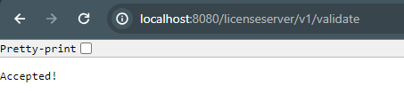

## Summary of Security Implementations
While we did not end up implementing everything we originally planned in terms of security, this document will outline what we were able to implement
as well as progress towards what we were unable to fully implement. This document includes the following topics:
1. Logins and Encryption
2. Input Sanitation
3. SQL Database Access
4. Web Server Endpoints for SQL Database

## Logins and Encryption
We designed a method of authentication that allows for both a coach login and an athlete login.
Through this login process, we will know if the user is allowed to send announcements, which team they're a part of, and more.
To keep the user's passwords safe, we added a basic level of encryption to their passwords when they're stored in the database.
Furthermore, we added simple password protection on our login screen. We did not have time to convert this login screen to a
web-based, HTTPs login screen (which would prevent an anonymous user from direct communication with our SQL Server),
but we did create SQL tables that would allow for this process in the future.

## Input Sanitation
To prevent SQL injection, we've implemented a text replacement function that converts all single quotation marks (') to a pair
of single quotation marks (''). This serves as SQL's escape sequence for apostrophes, which allows them to be used in the user's
various inputs. This is a more recent change, so this implementation has not been tested in-depth.

## SQL Database Access
It is technically possible to limit which queries can be run by the user when they're directly connected to the SQL database,
however we've decided it would be better overall to just implement a web server instead so we don't have to worry about
adding credentials for every new user connecting to said database directly and modifying their permissions every time.
We've done our best to prevent malicious use of any in-built SQL functions in the Python application itself, but since the
credentials are used in said Python application, it would be trivial for an attacker to take those credentials and use them
to form a direct connection with another application (like Microsoft SQL Management Studio) for more arbitrary execution of
SQL queries.

## Web Server Endpoints for SQL Database
At the start of this project, we wanted to ensure all requests made from the user went through an intermediary when communicating
with the SQL server. This would allow us not to give away important credentials to access the SQL server in our application.
Unfortunately, we were not able to fully implement this feature of our project, although it is entirely possible to run the
web server and have it communicate with our SQL database. There are three primary tables in the SQL Database that this web server
relies on, and those are the Admins table, the Users table, and the Signatures table. The web server we referenced was designed
to be a licensing server, which means it would distribute license keys to different devices to limit who can log in to the server
and the number of devices they could use to log in. We planned to modify this functionality to accept credentials, but as we said
before, we ended up running out of time. This feature is definitely possible in a future implementation, however.

### Example of Web Server Running:
